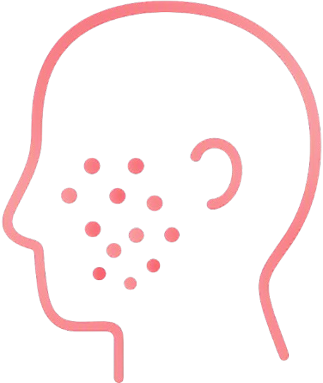
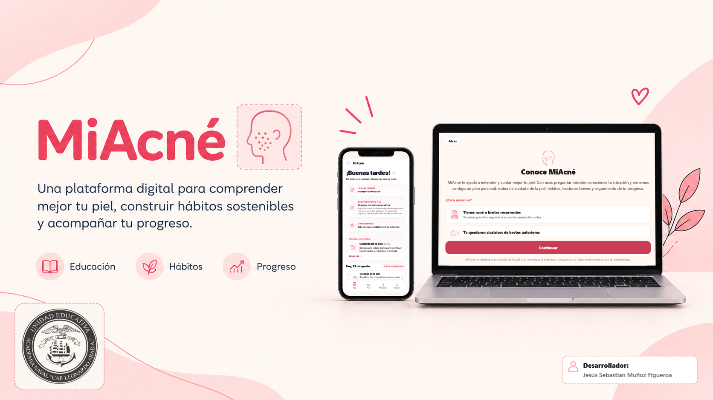
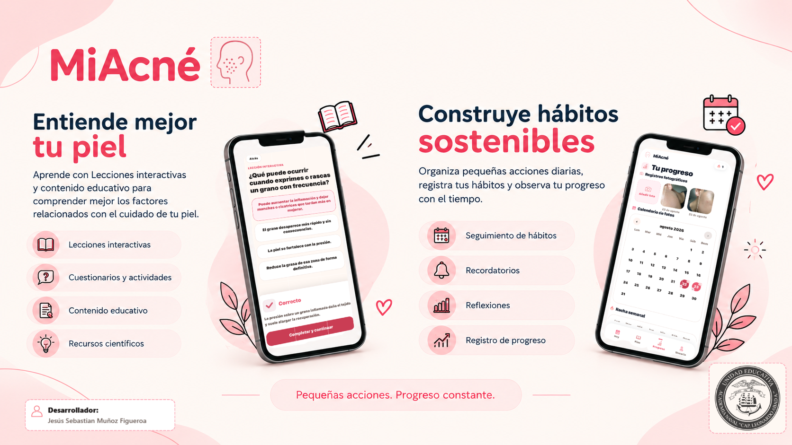

  

# MiAcné

> Plataforma digital multiplataforma de acompañamiento y educación para el cuidado de la piel y la formación de hábitos relacionados con el bienestar.

  <strong>Educación</strong> · <strong>Hábitos</strong> · <strong>Seguimiento</strong> · <strong>Personalización local</strong>

  

---

## ¿Qué es MiAcné?

MiAcné es una plataforma digital multiplataforma —con aplicación móvil y versión web— diseñada para acompañar al usuario en el aprendizaje sobre el acné, el cuidado de la piel y la construcción de hábitos relacionados con el bienestar.

La plataforma combina educación, personalización, organización, seguimiento, hábitos, reflexión y progreso. A partir de la información que el usuario comparte sobre su piel, rutinas, hábitos, contexto y objetivos, MiAcné construye una experiencia individualizada para ayudarle a sostener acciones pequeñas y consistentes.

MiAcné tiene un propósito educativo y de acompañamiento. No sustituye una evaluación médica ni pretende diagnosticar o prescribir tratamientos.

## ¿Por qué MiAcné?

Las personas que conviven con acné pueden necesitar más que información aislada. También pueden beneficiarse de una forma clara de organizar acciones diarias, aprender progresivamente, registrar consistencia, reflexionar sobre su experiencia y observar cambios con el tiempo.

MiAcné reúne esos elementos en una sola plataforma: guía inicial, plan personalizado, rutina diaria, microlecciones, recordatorios, seguimiento de hábitos, registros de progreso y continuidad de cuenta cuando el usuario inicia sesión.

## Funciones principales

### Cuestionario inicial guiado

El onboarding recopila información contextual sobre piel, características relacionadas con el acné, rutina, productos, hábitos, sueño, estrés, alimentación, objetivos, compromiso y contexto ambiental. Este cuestionario orienta la experiencia dentro de la app, pero no funciona como herramienta diagnóstica.

### Perfil personalizado y recomendaciones

MiAcné utiliza un sistema local y determinístico de personalización para construir un perfil educativo, prioridades, áreas de enfoque, recomendaciones relacionadas con hábitos y orientación básica de cuidado de la piel. La personalización se genera dentro del proyecto a partir de reglas y contenido local.

### Plan semanal personalizado

El plan se adapta a las respuestas del usuario y estima un horizonte de 8 a 16 semanas. Incluye semanas organizadas, hitos, actividades, logros esperados y progresión del plan, siempre desde una perspectiva de hábitos y educación.

### Panel Hoy

El panel diario muestra saludo, fecha, prioridad del día, tareas, rutina de cuidado, lección diaria, hábitos, reflexión, registro de progreso y mensajes de consistencia basados en actividad real. La racha diaria se calcula al completar las tareas requeridas del día.

### Microlecciones diarias

Las microlecciones presentan contenido breve y rotativo sobre cuidado de la piel, hábitos y toma de decisiones informadas. Cada lección incluye cinco preguntas, explicaciones y seguimiento de progreso educativo.

### Rutina de cuidado de la piel

La app organiza una rutina diaria con pasos básicos como limpieza, hidratación y protección solar, con preguntas de completado para registrar constancia. La guía se mantiene educativa y no reemplaza indicaciones profesionales.

### Registro de hábitos

MiAcné muestra hábitos personalizados, permite agregar hábitos propios y registra respuestas diarias de Sí/No. Cuando aplica, los hábitos incluyen duración estimada, notas y continuidad de registro.

### Recordatorios de hábitos

Los recordatorios se configuran por hábito, hora y frecuencia. En builds nativos usan notificaciones locales mediante Expo; en web dependen de las capacidades del navegador, permisos del usuario, service worker y Web Push cuando está disponible.

### Reflexión e insights

La reflexión guiada invita al usuario a escribir sobre su día, identificar aprendizajes y planear pequeños ajustes para mañana. Los insights se generan localmente a partir de las respuestas del usuario y no representan terapia, evaluación médica ni atención profesional.

### Registro de progreso

El flujo de progreso permite guardar notas diarias, fotografías opcionales, observaciones personales y registros históricos. Las fotos se usan para seguimiento visual del usuario, no para análisis facial ni diagnóstico.

### Visualización de progreso

La pantalla de progreso muestra calendario, registros fotográficos, racha semanal, hábitos completados, reflexiones registradas y adherencia. Las métricas se calculan desde datos persistidos del usuario.

### Biblioteca educativa

La biblioteca contiene lecciones educativas con artículos breves, quizzes, referencias y rotación de contenido. El catálogo incluye fuentes como American Academy of Dermatology (AAD), DermNet NZ, NICE, Cochrane, PubMed y Mayo Clinic.

### Educación nutricional

La sección de nutrición presenta alimentos y componentes nutricionales como contenido educativo. No prescribe dietas, no promete resultados médicos y no reemplaza orientación profesional.

### Clima y calidad del aire

MiAcné puede consultar información ambiental mediante Open-Meteo, incluyendo temperatura, humedad, índice UV, AQI, PM2.5 y PM10, para aportar contexto práctico a la experiencia del usuario.

### Cuenta y sincronización

El proyecto incluye autenticación con Clerk, registro e inicio de sesión con correo y contraseña, y acceso con Google cuando la configuración está disponible. Los usuarios autenticados pueden conservar perfil, estado del onboarding, plan, hábitos, progreso, recordatorios y contenido educativo asignado entre sesiones y dispositivos.

### Modo invitado

El modo invitado permite explorar MiAcné sin crear una cuenta. Sus datos viven solo en memoria durante la sesión invitada y no se sincronizan; se pierden cuando termina la sesión o se reinicia el entorno de ejecución.

### Sincronización de fotos de progreso

Para usuarios autenticados, la arquitectura separa los datos estructurados de las fotografías. Los metadatos de progreso se sincronizan como datos de cuenta, mientras que las fotos se almacenan de forma privada mediante endpoints autenticados y Cloudflare R2. No se exponen URLs públicas de fotos.

## Cómo funciona MiAcné

1. Conoce MiAcné.
2. Completa el onboarding.
3. Construye tu perfil.
4. Recibe un plan personalizado.
5. Aprende con microlecciones.
6. Completa hábitos y rutinas.
7. Registra tu progreso.
8. Reflexiona sobre tu experiencia.
9. Revisa tu evolución.
10. Continúa construyendo hábitos.

## Personalización

La personalización se genera a partir de la información que el usuario comparte y de su comportamiento dentro de la plataforma. MiAcné puede adaptar áreas de enfoque, hábitos, contenido educativo, duración del plan, prioridades diarias e insights de reflexión.

El sistema actual es local y determinístico: trabaja con reglas, plantillas y contenido dentro del repositorio. No diagnostica, no prescribe y no envía respuestas del cuestionario a un proveedor externo de personalización.

## Enfoque educativo

MiAcné está diseñado para ayudar al usuario a comprender mejor el acné, el cuidado de la piel, la constancia, los hábitos y otros comportamientos relacionados con el bienestar.

El contenido promueve decisiones prudentes, expectativas realistas y consulta con un dermatólogo u otro profesional de salud calificado cuando hay dolor, lesiones profundas, cicatrices, cambios preocupantes o impacto emocional importante.

## Seguimiento de hábitos y progreso

El seguimiento se apoya en registros diarios simples: hábitos completados, rutina de cuidado, reflexión, notas, fotografías opcionales y tareas requeridas del día. La app convierte esos registros en métricas visuales para que el usuario observe continuidad, adherencia y evolución sin depender de promesas de resultados.

## Sincronización y continuidad de cuenta

Cuando el usuario inicia sesión, MiAcné puede mantener continuidad entre sesiones y dispositivos mediante una capa de sincronización autenticada. El proyecto usa Cloudflare KV para datos estructurados, Cloudflare R2 para fotos privadas de progreso y Cloudflare Pages Functions para endpoints de sincronización.

En web, los recordatorios pueden apoyarse en Web Push y un worker programado cuando el navegador y los permisos lo permiten. En modo invitado, la información no se sincroniza.

## Disponibilidad por plataforma

| Plataforma | Estado | Forma de acceso |
|---|---|---|
| Android | Implementado | Aplicación móvil |
| Navegador web | Implementado y desplegado | Navegador |
| Escritorio | Disponible mediante web | Chrome/Edge/u otro navegador compatible |
| iOS | Configurado en el proyecto; build nativo no verificado | Próxima fase / instalación según build disponible |

### Android

El proyecto contiene configuración Android para una aplicación móvil Expo/React Native. El repositorio actual no incluye un archivo APK o AAB público, por lo que la guía de instalación para usuarios finales queda pendiente.

### Navegador web y computadora

La versión web está configurada para ejecutarse en navegador y desplegarse en Cloudflare Pages. El host de producción configurado en el proyecto es [miacne.pages.dev](https://miacne.pages.dev). En computadora, MiAcné se usa mediante la versión web; no hay una aplicación nativa de Windows o macOS en el repositorio.

### iOS

El proyecto incluye configuración iOS en Expo, pero no hay un archivo `.ipa` ni un build nativo verificado en el repositorio actual. Usar la versión web desde iPhone no equivale a una aplicación nativa iOS; las capacidades como notificaciones dependen del navegador, del sistema y de la forma de instalación web disponible.

  

---

# Instalación

Las guías de instalación se publicarán de acuerdo con cada plataforma y solo incluirán métodos disponibles o verificados por el proyecto.

## MiAcné para iOS

> **Guía en preparación.**
>
> Próximamente se publicarán los pasos completos para instalar y utilizar MiAcné en iPhone.

## MiAcné para Android

> **Guía en preparación.**
>
> Próximamente se publicarán los pasos completos para instalar y utilizar MiAcné en Android.

## MiAcné en computadora

La experiencia de escritorio se ofrece mediante la versión web de MiAcné.

> **Guía en preparación.**
>
> Próximamente se publicarán los pasos para acceder a MiAcné desde una computadora.

# Tecnología

Tecnologías y servicios verificados en el repositorio actual:

| Área | Tecnología |
|---|---|
| Aplicación | React Native, Expo, JavaScript |
| Web | React Native Web, manifiesto web/PWA, service worker |
| Persistencia local | AsyncStorage |
| Autenticación | Clerk, correo/contraseña, Google Sign-In cuando está configurado |
| Sincronización | Cloudflare Pages Functions, Cloudflare KV |
| Fotos privadas | Cloudflare R2, endpoints autenticados |
| Registro fotográfico | expo-camera |
| Recordatorios | expo-notifications, Web Push, worker programado |
| Ambiente | Open-Meteo para clima y calidad del aire |
| UI | Expo Linear Gradient, NativeWind/Tailwind CSS, react-native-css |

# Créditos

**Desarrollador**

Jesús Sebastian Muñoz Figueroa

**Institución**

Unidad Educativa Academia Naval Cap. Leonardo Abad A.

  

**Contacto**

Email: figueroa.jesusmf@gmail.com

Teléfono: 0959752659

# Uso responsable

MiAcné es una herramienta educativa y de acompañamiento. No diagnostica, no prescribe, no garantiza resultados y no reemplaza una evaluación médica profesional.

Si el acné es doloroso, profundo, persistente, deja cicatrices, empeora de forma marcada o afecta tu bienestar emocional, lo más adecuado es consultar con un dermatólogo o un profesional de salud calificado.
