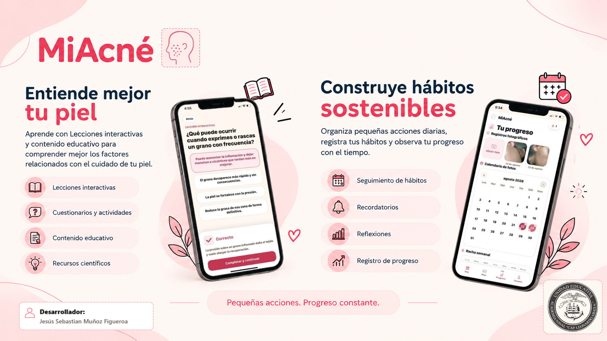
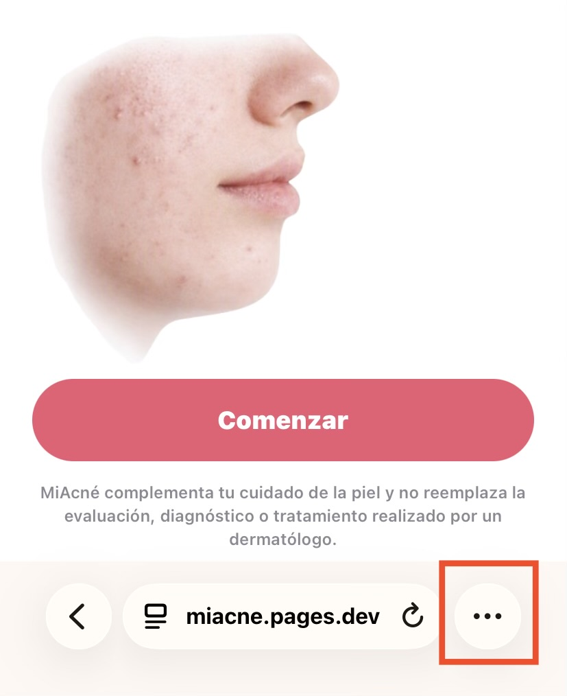
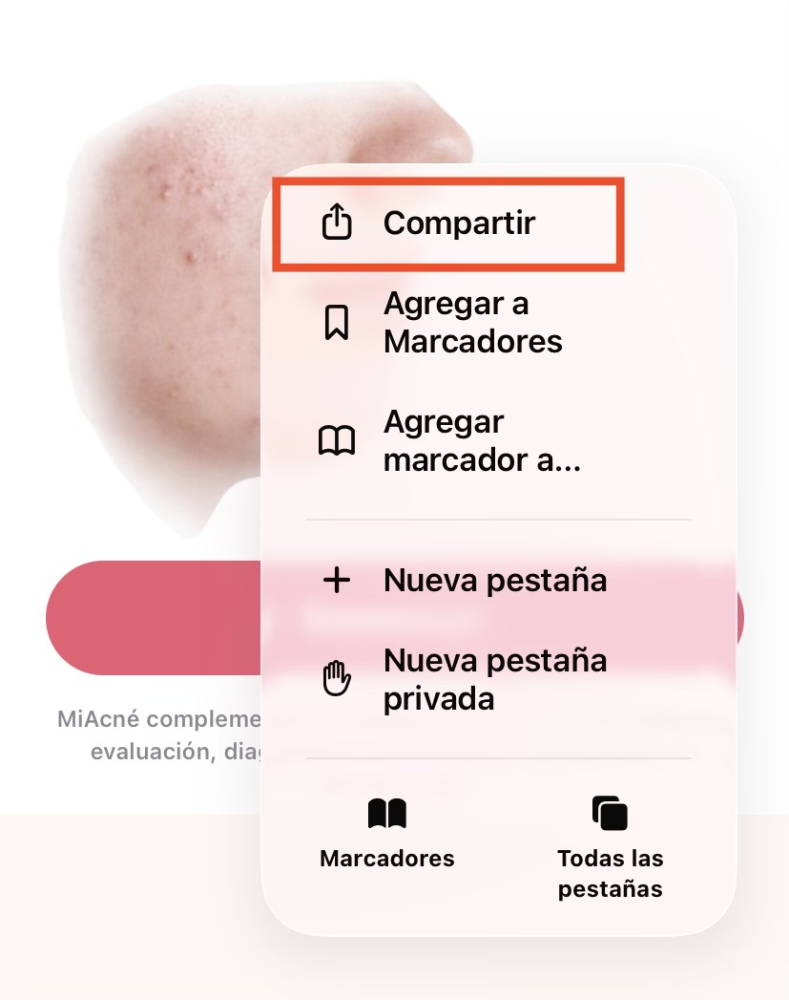
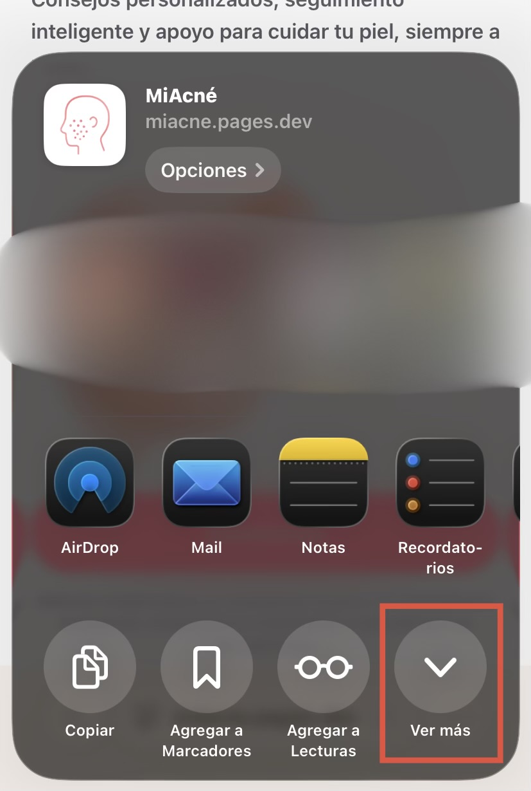
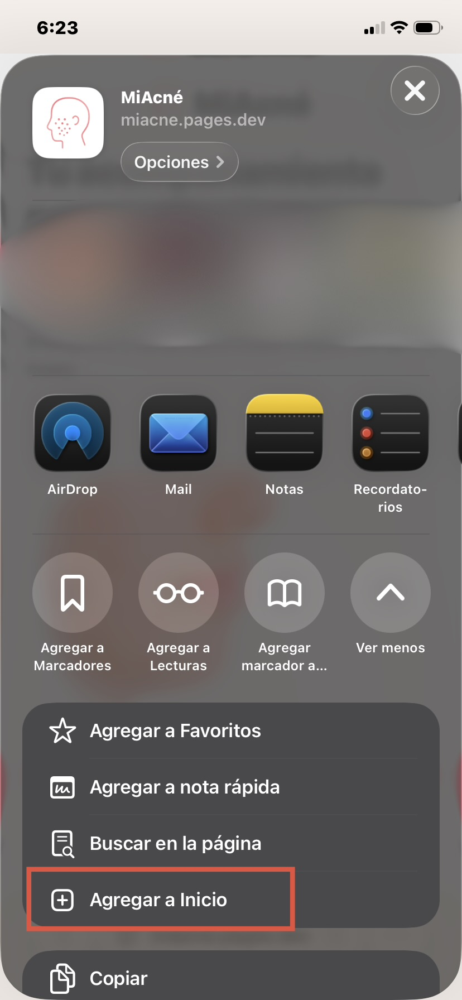
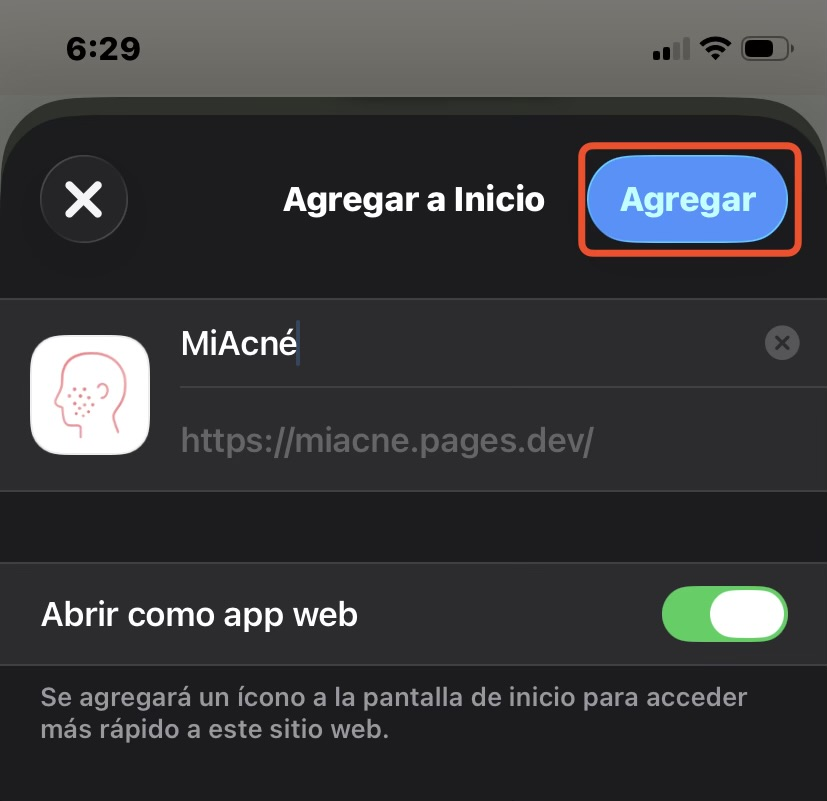
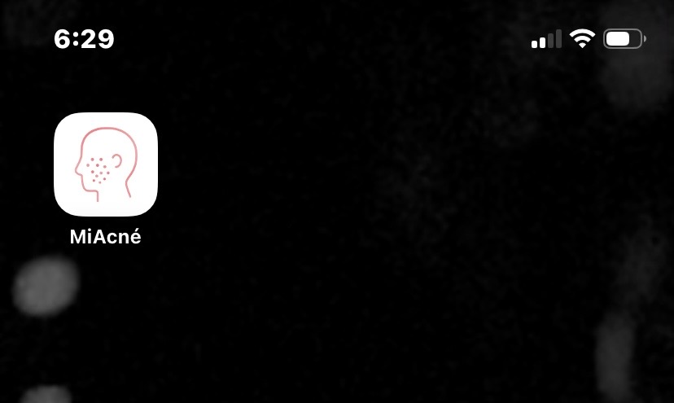

  

# MiAcné

> Plataforma digital multiplataforma de acompañamiento y educación para el cuidado de la piel y la formación de hábitos relacionados con el bienestar.

  <strong>Educación</strong> · <strong>Hábitos</strong> · <strong>Seguimiento</strong> · <strong>Personalización basada en el perfil</strong>

  

---

## ¿Qué es MiAcné?

MiAcné es una plataforma digital multiplataforma —con versión móvil y versión web— diseñada para acompañar al usuario en el aprendizaje sobre el acné, el cuidado de la piel y la construcción de hábitos relacionados con el bienestar.

La plataforma combina educación, personalización, organización, seguimiento, hábitos, reflexión y progreso. A partir de la información que el usuario comparte sobre su piel, rutinas, hábitos, contexto y objetivos, MiAcné construye una experiencia individualizada para ayudarle a sostener acciones pequeñas y consistentes.

MiAcné tiene un propósito educativo y de acompañamiento. No sustituye una evaluación médica ni pretende diagnosticar o prescribir tratamientos.

  <a href="#instalación"><strong>→ Acceder a MiAcné</strong></a>

## ¿Por qué MiAcné?

Las personas que conviven con acné pueden necesitar más que información aislada. También pueden beneficiarse de una forma clara de organizar acciones diarias, aprender progresivamente, registrar consistencia, reflexionar sobre su experiencia y observar cambios con el tiempo.

MiAcné reúne esos elementos en una sola plataforma: guía inicial, plan personalizado, rutina diaria, lecciones interactivas, recordatorios, seguimiento de hábitos, registros de progreso y continuidad de cuenta cuando el usuario inicia sesión.

## Funciones principales

### Cuestionario inicial guiado

El cuestionario inicial recopila información contextual sobre piel, características relacionadas con el acné, rutina, productos, hábitos, sueño, estrés, alimentación, objetivos, compromiso y contexto ambiental. Este cuestionario orienta la experiencia personalizada dentro de la plataforma.

### Personalización basada en el perfil

MiAcné adapta la experiencia usando la información que el usuario comparte sobre su piel, sus hábitos, su contexto y sus objetivos. A partir del perfil se ajustan las prioridades, las áreas de enfoque, los hábitos, el plan, el contenido educativo, las reflexiones y las recomendaciones de productos, en lugar de ofrecer una experiencia genérica. La personalización se genera dentro del proyecto mediante reglas y contenido integrado.

### Plan semanal personalizado

El plan se adapta a las respuestas del usuario y estima un horizonte de 8 a 16 semanas. Incluye semanas organizadas, hitos, actividades, logros esperados y progresión del plan, siempre desde una perspectiva de hábitos y educación.

### Panel Hoy

El panel diario muestra saludo, fecha, prioridad del día, tareas, rutina de cuidado, lección diaria, hábitos, reflexión, registro de progreso y mensajes de consistencia basados en actividad real. La racha diaria se calcula al completar las tareas requeridas del día.

### Lecciones interactivas diarias

Las lecciones interactivas presentan contenido breve y rotativo sobre cuidado de la piel, hábitos y toma de decisiones informadas. Cada lección incluye cinco preguntas, explicaciones y seguimiento de progreso educativo.

### Rutina de cuidado de la piel

MiAcné organiza una rutina diaria con pasos básicos como limpieza, hidratación y protección solar, con preguntas de completado para registrar constancia.

### Registro de hábitos

MiAcné muestra hábitos personalizados, permite agregar hábitos propios y registra respuestas diarias de Sí/No. Cuando aplica, los hábitos incluyen duración estimada, notas y continuidad de registro.

### Recordatorios de hábitos

Los recordatorios se configuran por hábito, hora y frecuencia. En la versión móvil utilizan notificaciones locales mediante Expo. En la versión web dependen de las capacidades del navegador y de los permisos del dispositivo, con apoyo de las notificaciones mediante Web Push cuando están disponibles.

### Reflexión y Observaciones

La reflexión guiada invita al usuario a escribir sobre su día, identificar aprendizajes y planear pequeños ajustes para mañana. Las Observaciones se generan localmente a partir de las respuestas del usuario.

### Registro de progreso

El flujo de progreso permite guardar notas diarias, fotografías opcionales, observaciones personales y registros históricos. Las fotografías se utilizan únicamente para el seguimiento visual del propio usuario.

### Visualización de progreso

La pantalla de progreso muestra calendario de fotos, registros fotográficos, racha semanal, hábitos completados y reflexiones registradas. Las métricas se calculan desde los datos persistidos del usuario.

### Recursos científicos

Los recursos científicos reúnen lecciones educativas con artículos breves, cuestionarios, referencias y rotación de contenido. El catálogo incluye fuentes como American Academy of Dermatology (AAD), DermNet NZ, NICE, Cochrane, PubMed y Mayo Clinic.

### Educación nutricional

La sección de nutrición presenta alimentos y componentes nutricionales como contenido educativo para apoyar decisiones informadas sobre la alimentación. No prescribe dietas ni promete resultados.

### Productos recomendados

A partir del perfil del usuario, MiAcné recomienda productos de un catálogo seleccionado, orientado por ingredientes y evidencia. Para cada producto la app explica por qué es recomendado según las características de la piel y su sensibilidad, los ingredientes clave, qué considerar y cuándo podría no ser adecuado, e incluye referencias y alternativas accesibles cuando existen. Los precios se muestran únicamente como rangos de referencia (`$`, `$$`, `$$$`). La sección es educativa: no realiza compras ni usa publicidad de afiliados.

### MiAcné Plus

MiAcné Plus es la sección premium de la plataforma y amplía el cuidado con tres herramientas: Productos recomendados, Recursos científicos (Biblioteca) y Nutrición.

Actualmente, MiAcné Plus utiliza una suscripción de prueba simulada para demostrar el flujo de activación y acceso a las funciones premium. No se realiza ningún cobro real.

### Información ambiental

MiAcné obtiene información ambiental mediante Open-Meteo a partir de la ubicación que el usuario comparte durante el cuestionario inicial (temperatura, humedad, índice UV y calidad del aire). Esta información queda como contexto del perfil y puede informar futuras recomendaciones.

### Cuenta y sincronización

El proyecto incluye autenticación con Clerk, registro e inicio de sesión con correo y contraseña, y acceso con Google cuando la configuración está disponible. Los usuarios autenticados pueden conservar perfil, estado del cuestionario inicial, plan, hábitos, progreso, recordatorios y contenido educativo asignado entre sesiones y dispositivos.

### Modo invitado

El modo invitado permite explorar MiAcné sin crear una cuenta. Sus datos viven solo en memoria durante la sesión invitada y no se sincronizan; se pierden cuando termina la sesión o se reinicia el entorno de ejecución.

### Sincronización de fotos de progreso

Para usuarios autenticados, la arquitectura separa los datos estructurados de las fotografías. Los metadatos de progreso se sincronizan como datos de cuenta, mientras que las fotografías se almacenan de forma privada mediante rutas autenticadas y Cloudflare R2. No se exponen direcciones web públicas de las fotografías.

## Cómo funciona MiAcné

1. Conoce MiAcné.
2. Completa el cuestionario inicial.
3. Construye tu perfil.
4. Recibe una experiencia personalizada.
5. Consulta tu plan.
6. Aprende con contenido diario.
7. Registra hábitos y rutinas.
8. Reflexiona y registra tu progreso.
9. Revisa tu evolución.
10. Continúa construyendo hábitos.

## Personalización

La personalización se construye a partir de la información que el usuario comparte y de sus hábitos dentro de la plataforma. MiAcné adapta áreas de enfoque, rutinas, contenido educativo, duración del plan, prioridades diarias y espacios de reflexión.

El sistema organiza estas experiencias mediante reglas y contenidos propios del proyecto, lo que permite ofrecer un acompañamiento progresivo y coherente con las necesidades de cada persona.

## Enfoque educativo

MiAcné está diseñado para ayudar al usuario a comprender mejor el acné, el cuidado de la piel, la constancia, los hábitos y otros comportamientos relacionados con el bienestar.

El contenido promueve decisiones prudentes, expectativas realistas y consulta con un dermatólogo u otro profesional de salud calificado cuando hay dolor, lesiones profundas, cicatrices, cambios preocupantes o impacto emocional importante.

## Seguimiento de hábitos y progreso

El seguimiento se apoya en registros diarios simples: hábitos completados, rutina de cuidado, reflexión, notas, fotografías opcionales y tareas requeridas del día. MiAcné convierte esos registros en métricas visuales para que el usuario observe continuidad y evolución en el tiempo, sin depender de promesas de resultados.

## Sincronización y continuidad de cuenta

Cuando el usuario inicia sesión, MiAcné puede mantener la continuidad de su información entre sesiones y dispositivos mediante un sistema de sincronización autenticado.

El proyecto utiliza Cloudflare KV para almacenar datos estructurados, Cloudflare R2 para las fotografías privadas de progreso y Cloudflare Pages Functions para gestionar las rutas de sincronización.

En la versión web, los recordatorios utilizan notificaciones web cuando el navegador y los permisos del dispositivo lo permiten. En modo invitado, la información no se sincroniza.

## Disponibilidad por plataforma

| Plataforma | Estado | Forma de acceso |
|---|---|---|
| Android | Implementado | Versión móvil |
| Navegador web | Implementado y desplegado | Navegador |
| Computadora | Disponible mediante la versión web | Navegador compatible |
| iOS | Disponible mediante la versión web instalable | Acceso desde Safari u otro navegador compatible |

### Android

La versión móvil para Android está implementada en el proyecto mediante Expo y React Native. El archivo APK y la guía de instalación para usuarios finales están disponibles en [GitHub Releases](https://github.com/jesusmff/miacne/releases).

### Navegador web y computadora

La versión web está desplegada en Cloudflare Pages y accesible desde [miacne.pages.dev](https://miacne.pages.dev). En computadora, MiAcné se utiliza mediante esta misma experiencia web desde cualquier navegador compatible.

### iOS

MiAcné está disponible en iPhone mediante su versión web instalable desde Safari u otro navegador compatible. Funciones como los recordatorios dependen del navegador y de los permisos del dispositivo.

  

---

# Instalación

Las guías de instalación describen cómo acceder a MiAcné según cada plataforma e incluyen únicamente métodos disponibles o verificados por el proyecto.

## MiAcné para iOS

MiAcné puede instalarse en la pantalla de inicio del iPhone como una aplicación web utilizando el navegador. Los siguientes pasos muestran el proceso en Safari.

### Paso 1 — Abre MiAcné en el navegador

Abre el sitio web de MiAcné en `https://miacne.pages.dev` desde Safari o desde el navegador que utilices en tu dispositivo.

En Safari, localiza el ícono de opciones situado en la parte inferior de la pantalla. En la imagen aparece resaltado con un recuadro rojo. Este ícono permite acceder a más opciones para la página.

*Ejemplo en Safari.*

### Paso 2 — Selecciona «Compartir»

Haz clic en la opción «Compartir», que aparece dentro del menú de opciones del navegador. Esta opción está resaltada con un recuadro rojo en la imagen y permite compartir el sitio web que estás visitando.

### Paso 3 — Selecciona «Ver más»

Presiona la opción «Ver más», que aparece dentro del menú de compartir del navegador. Esta opción está resaltada con un recuadro rojo y permite mostrar opciones adicionales relacionadas con el sitio web.

### Paso 4 — Selecciona «Agregar a Inicio»

Selecciona la opción «Agregar a Inicio». Esta opción permite añadir MiAcné a la pantalla de inicio del dispositivo.

### Paso 5 — Confirma con «Agregar»

Toca el botón «Agregar», que aparece dentro de la ventana titulada «Agregar a Inicio». Este botón está resaltado en la imagen y confirma la acción de añadir el acceso directo de MiAcné a la pantalla de inicio de tu dispositivo.

### Paso 6 — Abre MiAcné desde la pantalla de inicio

El ícono de MiAcné aparecerá en la pantalla de inicio de tu dispositivo. Este acceso directo te permitirá ingresar rápidamente a MiAcné cada vez que lo necesites.

## MiAcné para Android

MiAcné está disponible como aplicación Android mediante el archivo APK publicado en GitHub Releases. En la página de lanzamientos encontrarás el archivo de instalación junto con la guía completa paso a paso.

  <a href="https://github.com/jesusmff/miacne/releases"><strong>→ Descargar MiAcné para Android</strong></a>

## MiAcné para computadora

MiAcné está disponible mediante su versión web.

**[Acceder a MiAcné](https://miacne.pages.dev)**

# Tecnología

Tecnologías y servicios presentes en el proyecto:

| Área | Tecnología |
|---|---|
| Plataforma móvil | React Native, Expo, JavaScript |
| Web | React Native Web, manifiesto web/PWA, trabajador de servicio |
| Persistencia local | AsyncStorage |
| Autenticación | Clerk, correo y contraseña, Google cuando está configurado |
| Sincronización | Cloudflare Pages Functions, Cloudflare KV |
| Fotografías privadas | Cloudflare R2, rutas autenticadas |
| Registro fotográfico | expo-camera |
| Recordatorios | expo-notifications, Web Push |
| Información ambiental | Open-Meteo |
| Interfaz | NativeWind/Tailwind CSS, Expo Linear Gradient |

# Créditos

**Desarrollador**

Jesús Sebastian Muñoz Figueroa

**Institución**

Unidad Educativa Academia Naval Cap. Leonardo Abad A.

  

**Contacto**

Correo electrónico: figueroa.jesusmf@gmail.com

Teléfono: 0959752659

# Uso responsable

MiAcné es una herramienta educativa y de acompañamiento. No diagnostica, no prescribe, no garantiza resultados y no reemplaza una evaluación médica profesional.

Si el acné es doloroso, profundo, persistente, deja cicatrices, empeora de forma marcada o afecta tu bienestar emocional, lo más adecuado es consultar con un dermatólogo o un profesional de salud calificado.
